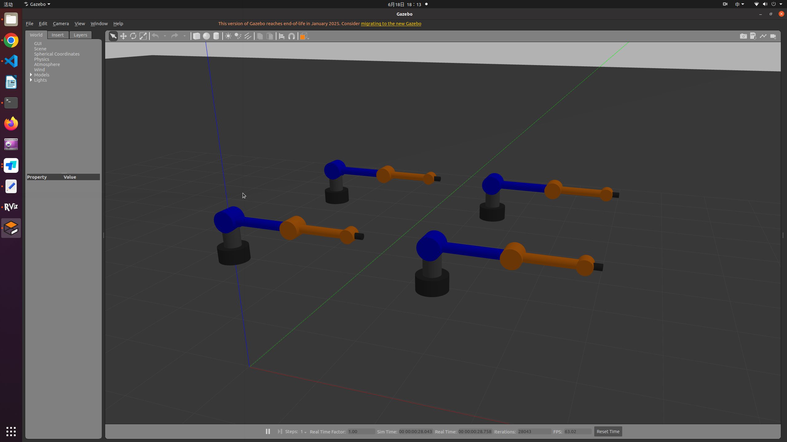
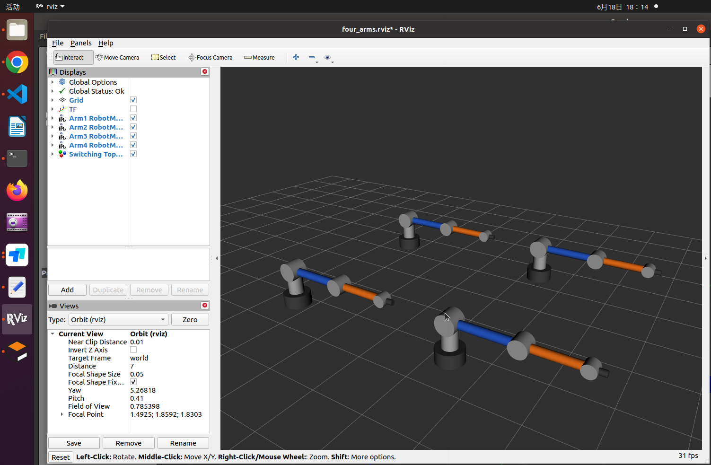

# Switching_Topology_PP_Tracking_Control_For_MAS
**Notice 1:** *ROS Implementation for the Second Subsection of the Simulation Study on Prescribed-Performance Cooperative Control of Networked Euler--Lagrange Systems Under Switching Topologies*

**Notice 2:** *This repository provides a runnable ROS/Gazebo simulation package for reproducing the submitted manuscript results. The full controller source code will be released after publication. This package contains precompiled ROS nodes and the required launch, configuration, model, and visualization files for review.*

## 1. Preliminary Preparation

Before running the code in this subsection, the runtime environment should be configured in advance.

### System Requirements

- Operating System: Ubuntu 20.04
- Robot Operating System: ROS Noetic
- ROS Installation Type: Full Desktop Version

The detailed installation tutorial for ROS Noetic can be found at:

https://wiki.ros.org/noetic/Installation/Ubuntu

After the installation is completed, please check whether Gazebo and RViz can be opened properly.

## 2. Running the Tracking Control

Execute the following commands to run the tracking control code:


### 2.1 Clone the Repository

Clone the code of this repository into the home directory:

```bash
git clone https://github.com/CquAutomationChenGang/PP_Cooperative-Control-of-Networked-ELS-Under-Switching-Topologies.git
```
### 2.2 Source the Workspace

Source the ROS Noetic environment and the workspace:

```bash
source /opt/ros/noetic/setup.bash
cd ~/paper_demo_ws
source src/install/setup.bash
```
### 2.3 Gazebo-based Physical Simulation Platform for the Two-Link Robotic Manipulator

Launch the Gazebo-based physical simulation platform for the two-link robotic manipulator:

```bash
roslaunch two_link_arm_gazebo gazebo.launch 
```
**Notice 3:** *It should be noted that, as long as Gazebo and RViz are successfully launched, the error messages displayed in the terminal do not affect the execution of the simulation and can therefore be ignored, as illustrated in the following figure:*




### 2.4 Run the Observer Launch File

Run the observer launch file:

```bash
roslaunch switching_topology_pp_tracking_control_for_mas run.launch 

```

### 2.5 Run the Controller Launch File

Run the controller launch file:

```bash
roslaunch switching_topology_pp_tracking_control_for_mas tracking.launch
```
**Notice 4:** *The control algorithm is executed for 30 s and will be automatically terminated once the 30-second simulation period is completed.*

[](https://github.com/user-attachments/assets/9b937f8e-3759-4602-86bc-12c4c5829a92)


